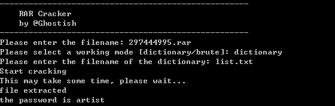

# Python RAR Cracker
A tiny python script for cracking rar file encrypted by a password

### Dependencies
+ [brute](https://github.com/rdegges/brute)
+ [python-unrar](https://github.com/matiasb/python-unrar)

### Usage
There are two working modes.  
+ In **dictionary** mode, the script loads each word in the dictionary and trys to decrypt the rarfile using that word.
+ In **brute** mode, the script trys every permutation of the given string set.
### Screenshot

### Warning
This script is only for learning purpose.
Never use it to break the law.